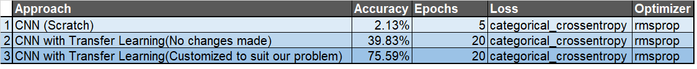

[//]: # (Image References)

[image1]: ./images/sample_dog_output.png "Sample Output"

# Dog Prediction App

### Project Motivation

The aim of the project is to create a web application that is able to identify a breed of dog if given a photo or image as input. Given an image of a dog, the algorithm will identify an estimate of the canine's breed. If supplied an image of a human, the code will identify the resembling dog breed.
The dataset for this project is given by Udacity. we are using python 3.6 with TensorFlow as Keras backend. Also, we'll use transfer learning and clearly see how transfer learning can be an effective method to train a machine learning model with fewer data and low compute resources.

![Sample Output][image1]

### Results
1. A Keras classifier network built from scratch and trained on the image data was able to achieve an accuracy of 3% when exposed to test images. 
2. A pre-trained VGG16 network was able to achieve an accuracy between roughly 40% with fixed extractors and not changes to the final layer
3. A a pre-trained vgg16 network attained an accuracy of roughly 75% when identifying test images, and could correctly identify the subjects of an additional six photos as dogs, humans, or neither.



### Libraries

This project makes use of the **cv2**, **keras**, **matplotlib**, **numpy**, **PIL**, **random**, **sklearn**, and **tqdm** libraries.

### Files

`dog_app.ipynb`: Jupyter notebook containing the body of the project

`extract_bottleneck_features.py`: Python program used to obtain bottleneck features for each pre-trained network

`haarcascades`: Folder containing an XML file of a Haar feature-based cascade image detector

`images`: Folder of demonstrative image files

`saved_models`: Best model saving location

### Usage

- Clone the repository and navigate to the downloaded folder:
```	
git clone https://github.com/udacity/dog-project.git
cd dog-project
```

- Download the [dog dataset](https://s3-us-west-1.amazonaws.com/udacity-aind/dog-project/dogImages.zip).  Unzip the folder and place it in the repo, at location `path/to/dog-breed-classifier/data/dog_images`. 

- Download the [human dataset](https://s3-us-west-1.amazonaws.com/udacity-aind/dog-project/lfw.zip).  Unzip the folder and place it in the repo, at location `path/to/dog-breed-classifier/data/lfw`.  If you are using a Windows machine, you are encouraged to use [7zip](http://www.7-zip.org/) to extract the folder. 

- Download the [VGG-16 bottleneck features](https://s3-us-west-1.amazonaws.com/udacity-aind/dog-project/DogVGG16Data.npz) and the [Resnet50 bottleneck features](https://s3-us-west-1.amazonaws.com/udacity-aind/dog-project/DogResnet50Data.npz) for the two respective pre-trained classifiers.  Place them in the repo, at location `path/to/dog-breed-classifier/bottleneck_features`.

- Using a GPU to run this project is strongly recommended. If you plan to install TensorFlow with GPU support on your local machine, follow [this guide](https://www.tensorflow.org/install/) to install the necessary NVIDIA software on your system. 
- Open the notebook and follow the notebook code block by block
```
jupyter notebook dog_app.ipynb
```


### Acknowledgements

This project was done as part of Udacity's [Data Scientist Nanodegree](https://www.udacity.com/course/data-scientist-nanodegree--nd025). 
